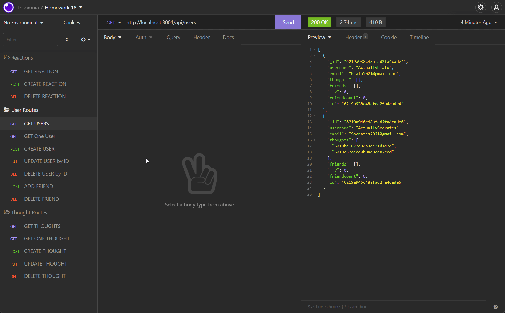

# social-network-api

## Description

This application is supposed to emulate a social network API, where users are created and can post their thoughts and ideas and also react to each other's thoughts.

## [Try it yourself!](https://github.com/JaggedComet/social-network-api)

Click on "Try it yourself" to get the link to the repository!

## Demo

<br>


## Installation

For the application to function, you need a coding software like the free [VScode](https://code.visualstudio.com/download) and a way to test backend software like [Insomnia](https://insomnia.rest/download). For the rest of the requirements, you will just install the required npms with ```npm i``` on the command line in the coding software you are using.

## Usage

You will first begin by doing a `git clone git@github.com:JaggedComet/social-network-api.git` in your command line at the destination of your choice using [GitBash](https://git-scm.com/downloads) or any other commandline interface. Then you will go to the command line in `VsCode` or the coding software of your choice and run `npm i` in order to install the required files. Then you would run `npx nodemon` in order to run the application. Then you will go to `Insomnia` or the backend testing software of your choice and use the `GET/POST/PUT/DELETE/UPDATE` routes seen in the api routes in order to add/remove/update/delete users and thoughts that you input.

## Technology

Here is the technology used along with links to them where applicable:

- [VScode](https://code.visualstudio.com/download)
- [NodeJS](https://nodejs.org/en/)<br>
- [Insomnia](https://insomnia.rest/download)<br>
- [Express](https://www.npmjs.com/package/express)<br>
- [Mongoose](https://www.npmjs.com/package/mongoose)<br>
- [Nodemon](https://www.npmjs.com/package/nodemon)<br>
- JavaScript<br>


## Credits

Special thanks to these friends who with me for three days trying to get this project done: <br>
- Github: [David Luu](https://github.com/MaestroLuu/) 
- Github: [Chris Muto](https://github.com/chrismuto/)


## Questions

If you have any additional questions regarding this application, please contact me via the channels provided below:<br />
____________________________________
Github:https://github.com/JaggedComet/<br>
Email: MarcoFlores1029@gmail.com<br>
